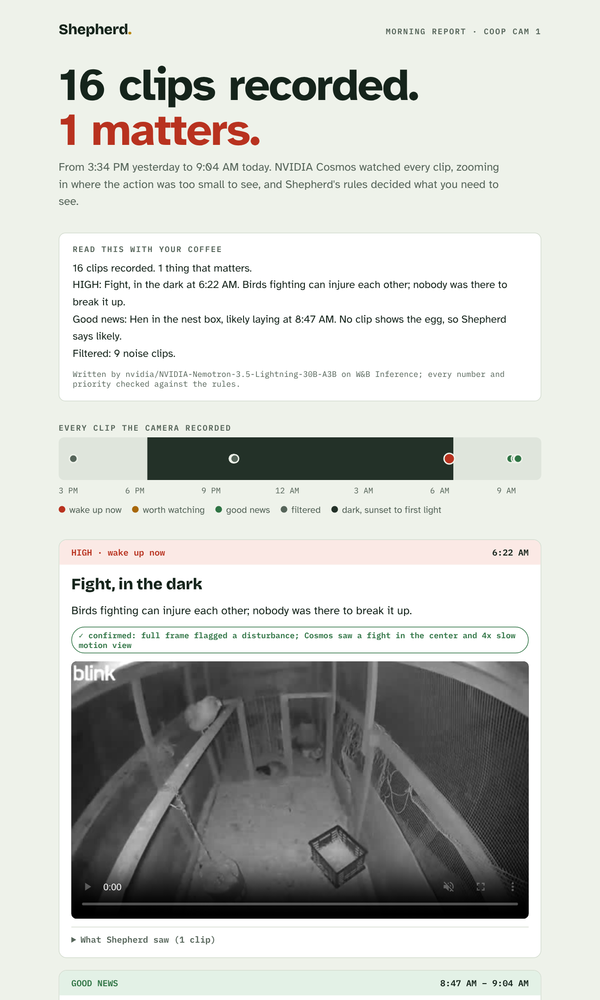

# Shepherd

**Shepherd reads every clip your farm camera records and tells you the ones that matter.**

Every video agent watches people, cars or forklifts. Nobody's watching the animals. Small farmers can't stand in the field all night, and the motion cameras they do have record so much that people switch the alerts off. Shepherd watches every clip instead. It groups repeat clips into one event, decides how urgent each event is, and hands the farmer one morning report with the clip behind every line.

- **Animal welfare:** no bird gets hurt because nobody was watching.
- **Farmer resources:** the night watch a small farm can't afford to hire.

Built at the VAST Builders Challenge: Real-Time Video Agents Hack, NYC, October 9, 2026.



## What it found on our real footage

We ran Shepherd on 16 clips from our own coop camera (a Blink motion camera), from 3:34 PM on Oct 8 to 9:04 AM on Oct 9:

| Result | Clips | What Cosmos said |
|---|---|---|
| **HIGH: Fight, in the dark, 6:22 AM** | 1 | Full frame: *"EVENT: disturbance"*. Zoomed center tile: *"YES. Two birds flap at each other in the back of the pen."* 4× slow motion: *YES* |
| **Good news: hen in the nest box, likely laying, 8:47–9:04 AM** | 6 | *"Yes. A hen is sitting inside the black plastic crate on the floor."* (all 6 clips) |
| Filtered as normal chicken business | 9 | Day b-roll, 5 night clips of birds shifting on the perch, and 2 early fight clips that Cosmos called normal |

Shepherd missed one thing: a single peck at the hen in the nest box (8:47). We report what the model said; nothing is tuned to the answer. Every Cosmos reply is saved in [`data/segments.json`](data/segments.json).

## How it works

```
coop clips ──> NVIDIA Cosmos Reason (CoreWeave GPUs) ──> rules ──> NVIDIA Nemotron (W&B Inference) ──> morning report
               + YOLO11 bird counts                      │                guard: rejects invented        + every step traced
               4 passes per clip:                        │                numbers, alerts or             in W&B Weave
               1. structured description                 │                priorities
               2. yes/no: fight? peck? hen in the crate? │
               3. 5 zoomed tiles (small, far-away action)│
               4. 4x slow motion (fast action)           └──> events written to VastDB (vast/)
```

**Cosmos sees, the rules decide, the language model only writes.**

- **Four looks per clip.** The small Cosmos model calls almost everything "normal" in a long form but answers direct yes/no questions well. The fight was a few dozen pixels in infrared at the back fence, so Shepherd also checks 5 zoomed tiles and a 4× slow-motion copy of every clip. The zoom found the fight that full frame missed, and raised no false fights in the other 15 clips.
- **Rules, not vibes** ([`shepherd/rules.py`](shepherd/rules.py)). Repeat clips become one event (fights within 10 min, nest-box sessions within 20). Urgency is tiered: HIGH (wake up now), LOW (worth watching), good news. An event is *confirmed* only when two signals agree. A clip Cosmos can't read is "can't tell", never a guess. Filename labels are never read; only the timestamp is (there's a test for it).
- **A guard on the language model** ([`shepherd/agent.py`](shepherd/agent.py)). NVIDIA Nemotron on W&B Inference writes the report from the rules' output. Shepherd rejects any draft that adds a number, drops or renames an event, or changes a priority, gives the model one retry with the reason, then falls back to the rules' own text. During the event, Nemotron invented a second alert twice; both drafts were rejected, and the traces show it.
- **Ask in plain English** ([`shepherd/ask.py`](shepherd/ask.py)). `python3 -m shepherd.ask "when was the last time a hen laid an egg?"` searches what Cosmos saw in every clip by meaning, not keywords: NVIDIA Nemotron reads the question and a one-line index per clip and picks the clips that answer it. The same kind of guard applies: it may only cite clips that exist, every time it writes must belong to a clip it cited, and it may not claim an egg (the camera can't see one). On our footage: *"9:04 AM on Oct 9, a hen was in the nest box, likely laying"*, with the 6 matching clips and Cosmos's words for each. Without a key, a small concept matcher answers and says so.
- **Everything traced** in W&B Weave: every Cosmos answer, every rule, every draft and why it was accepted or rejected.
- **VAST.** Our clips were uploaded to the VAST AI OS; [`vast/`](vast/) writes every event to a VastDB table (`shepherd_events`) with its evidence and provenance, then reads it back in a separate transaction to verify.

## Sponsor stack

| | Role in Shepherd |
|---|---|
| **VAST AI OS / VastDB** | Clip upload; event store with evidence and read-back verification |
| **NVIDIA Cosmos Reason** | Sees: descriptions, yes/no checks, zoom and slow-motion passes |
| **NVIDIA Nemotron** | Writes the morning report and answers plain-English questions (via W&B Inference) |
| **YOLO11** | Bird counts |
| **CoreWeave** | GPUs serving Cosmos and YOLO |
| **Weights & Biases** | Inference (Nemotron) and Weave tracing |
| **Cursor** | Build environment on the event VM |

## Run it

```bash
# On the event VM (needs the team's GPU endpoints):
python3 -u scripts/vm_direct.py      # Cosmos description + YOLO per clip  -> data/segments.json
python3 -u scripts/vm_questions.py   # yes/no checks
python3 -u scripts/vm_zoom.py        # 5 zoomed tiles per clip
python3 -u scripts/vm_slowmo.py      # 4x slow motion
python3 -u vast/write_events.py --write   # events -> VastDB

# Anywhere (needs WANDB_API_KEY, WANDB_ENTITY, WANDB_PROJECT; runs without them too):
pip install -r requirements.txt
python3 -m shepherd.agent            # rules + Nemotron report + Weave  -> docs/report.json
python3 scripts/build_site.py        # report page in docs/
python3 -m shepherd.ask "when was the last time a hen laid an egg?"   # plain-English search
python3 tests/test_rules.py          # 22 rule tests
python3 tests/test_ask.py            # search guard tests
```

## Repo map

- `shepherd/`: rules engine and agent
- `scripts/`: the Cosmos/YOLO passes run on the event VM, and the site builder
- `vast/`: VastDB event writer and pipeline check
- `web/`, `docs/`: the morning report page (GitHub Pages ready: Settings → Pages → main /docs)
- `clips/`: our 16 real coop clips · `data/`: every model answer
- `DESIGN.md`, `DEMO.md`: the spec and the demo script
